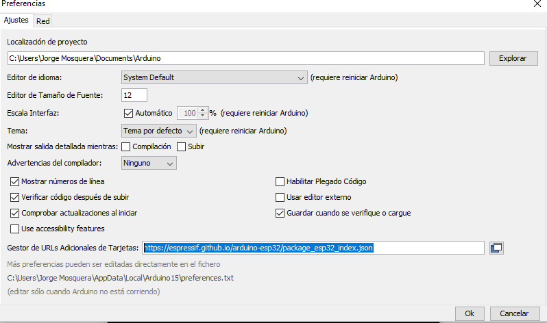

# IoT for Smart Cities (Sensor Low Cost)
 

## Instalación de la Tarjeta GALIoT Board

Para la instalación en Arduino IDE debemos seguir los siguientes pasos:

1. Abrir ARDUINO IDE
2. Debemos ir a la pestaña ***Archivo***->***Preferencias***.
	- En la pestaña ***Ajustes*** buscamos la opción: ***Gestor de URLs Adicionales de Tarjetas: ***
	- Pegamos la siguiente URL: `https://dl.espressif.com/dl/package_esp32_index.json`
	- Luego presionamos la opción ***OK*** y automáticamente se cerrará la ventana.

	

3. Debemos ir a la pestaña ***Herramientas***->***Placa***->***Gestor de tarjetas***.
	- Colocamos en la barra de búsqueda ***ESP32***.
	- Seleccionamos la opción que nos muestre ***ESP32 Dev Module***.
	- Instalamos y luego presionamos la opción de ***Cerrar***.

Con esto tendremos completa la instalación de nuestra tarjeta ESP32 y lista para ser programada.	 

